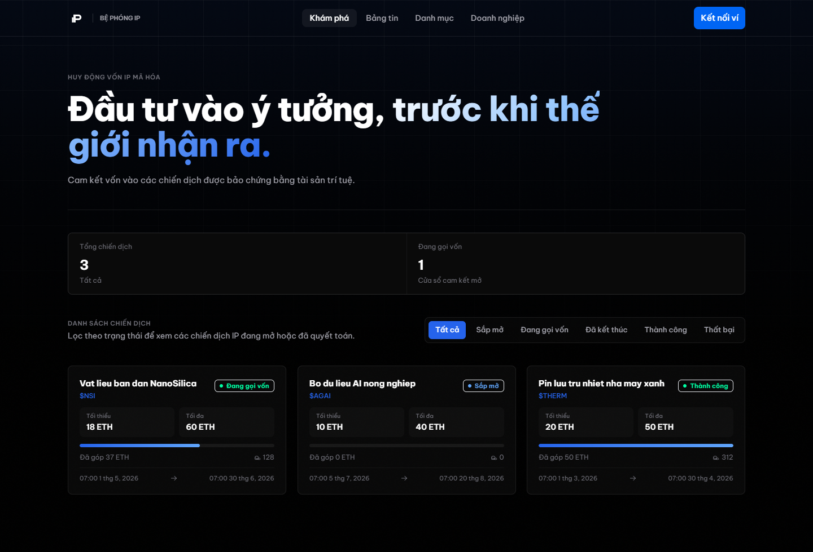
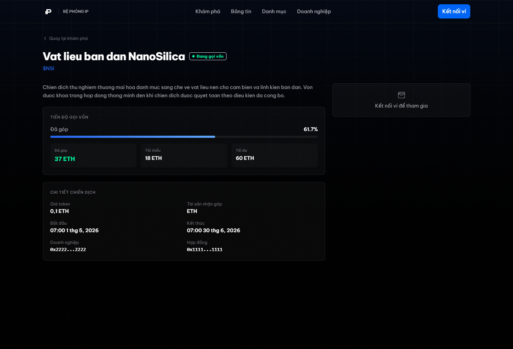
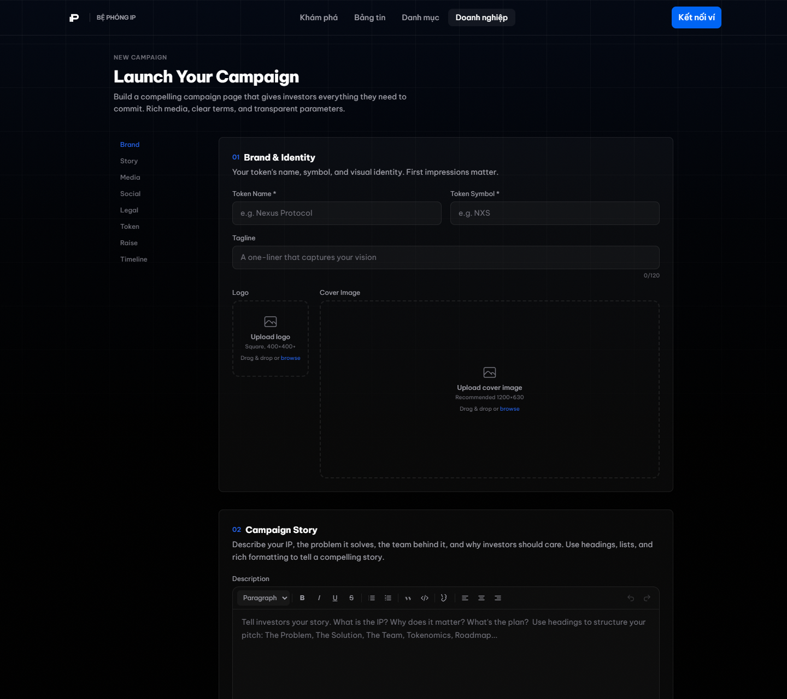
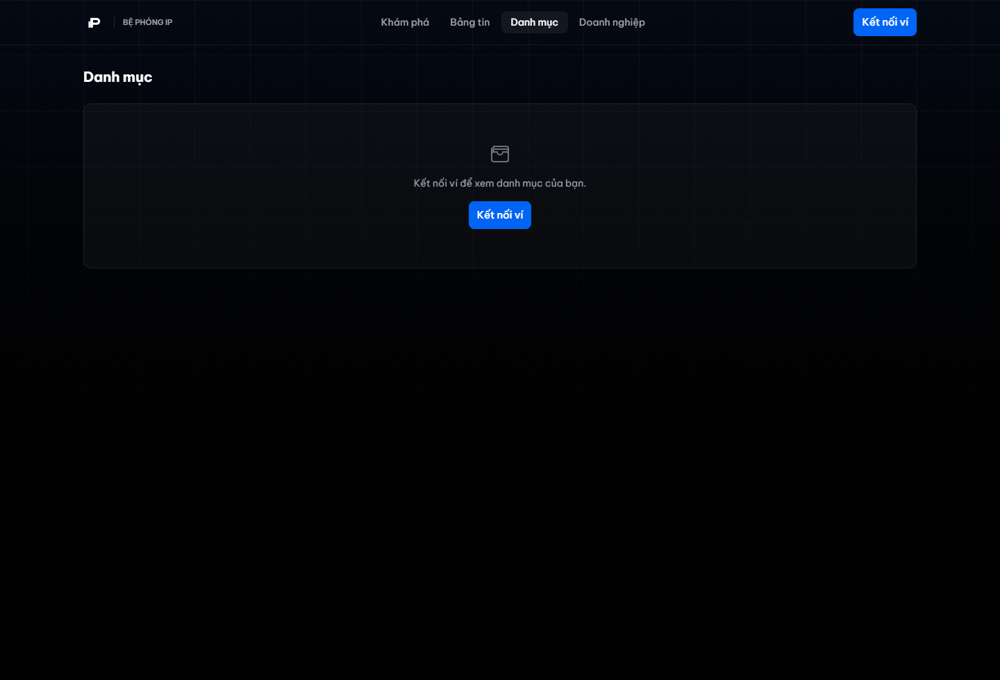

# IP Foundation Launchpad

Tài liệu này mô tả tính năng nền tảng IP Foundation Launchpad ở góc nhìn người dùng và rà soát pháp lý. Nội dung được viết cho đội ngũ pháp chế, luật sư, đối tác thương mại và người dùng đã quen với ví crypto, token, giao dịch on-chain và hợp đồng thông minh, nhưng không cần đọc mã nguồn để hiểu cách sản phẩm vận hành.

IP Foundation Launchpad là một nền tảng gọi vốn thử nghiệm cho sáng chế, nghiên cứu ứng dụng và tài sản trí tuệ có khả năng thương mại hóa. Mục tiêu của sản phẩm là giúp ý tưởng Việt Nam tiếp cận vốn toàn cầu trong một quy trình rõ ràng: doanh nghiệp tạo chiến dịch, nhà đầu tư cam kết vốn, vốn được khóa trong hợp đồng thông minh, và chiến dịch được quyết toán theo điều kiện đã công bố.

Hiện tại nền tảng đang chạy mô hình MVP trên Sepolia testnet. Các ảnh minh họa bên dưới được chụp bằng Playwright từ giao diện hiện tại; dữ liệu chiến dịch trong ảnh là dữ liệu demo để phục vụ tài liệu, không phải khoản đầu tư thực tế.


## Mục Đích Nền Tảng

IP Foundation không được thiết kế như một sàn giao dịch token thứ cấp. Nền tảng tập trung vào giai đoạn sớm của tài sản trí tuệ, nơi doanh nghiệp, nhóm nghiên cứu hoặc đơn vị sở hữu IP cần kiểm chứng nhu cầu vốn trước khi bước vào giai đoạn thương mại hóa sâu hơn.

Luồng sản phẩm hiện tại gồm bốn hành động chính:

1. Doanh nghiệp nộp chiến dịch IP, mô tả dự án, thông tin token, tài liệu, thời gian gọi vốn và điều kiện huy động.
2. Quản trị viên xem xét và phê duyệt chiến dịch trước khi chiến dịch xuất hiện công khai.
3. Nhà đầu tư kết nối ví và cam kết vốn vào một chiến dịch đang mở.
4. Sau khi hết thời gian gọi vốn, chiến dịch được quyết toán thành công hoặc thất bại theo điều kiện đã công bố.

Điểm quan trọng về mặt pháp lý là vốn không đi qua ví vận hành của nền tảng trong luồng chuẩn. Vốn được gửi vào hợp đồng thông minh của từng chiến dịch và chỉ được giải phóng sau khi chiến dịch được quyết toán.

## Vị Trí Sản Phẩm Trong Hệ Sinh Thái

Nền tảng có thể được hiểu là một lớp launchpad chuyên biệt cho IP-backed campaign, không phải DEX, không phải marketplace giao dịch thứ cấp, không phải hệ thống quản trị DAO và không phải nền tảng staking.

Trong phạm vi hiện tại, sản phẩm làm các việc sau:

- Cho phép doanh nghiệp tạo một chiến dịch gọi vốn gắn với tài sản trí tuệ hoặc kế hoạch thương mại hóa IP.
- Cho phép nhà đầu tư cam kết ETH vào chiến dịch được phê duyệt.
- Khóa vốn bằng smart contract trong thời gian chiến dịch.
- Tính kết quả chiến dịch theo logic nhị phân: thành công hoặc thất bại.
- Nếu thành công, token chiến dịch được tạo và nhà đầu tư có quyền nhận token theo phân bổ.
- Nếu thất bại, nhà đầu tư có quyền nhận hoàn tiền theo logic của hợp đồng.
- Cho phép doanh nghiệp rút phần vốn được chấp nhận khi chiến dịch thành công và đã quyết toán.

Trong phạm vi hiện tại, sản phẩm không làm các việc sau:

- Không hỗ trợ mua bán token thứ cấp trong nền tảng.
- Không cung cấp pool thanh khoản, AMM, order book hoặc chức năng DEX.
- Không triển khai governance token hoặc quyền biểu quyết DAO.
- Không tự động thực hiện KYC/KYB trong MVP hiện tại.
- Không hứa hẹn lợi nhuận, lãi suất, cổ tức hoặc quyền sở hữu công ty qua giao diện hiện tại.
- Không mô tả token như cổ phần doanh nghiệp.

Các giới hạn này cần được giữ rõ trong tài liệu người dùng, điều khoản chiến dịch và quy trình phê duyệt để tránh hiểu nhầm giữa quyền tham gia chiến dịch IP và quyền tài chính truyền thống.

## Đối Tượng Sử Dụng

### Doanh Nghiệp Hoặc Nhóm Sở Hữu IP

Đây là bên tạo chiến dịch. Họ có thể là startup, phòng nghiên cứu, nhóm kỹ sư, đơn vị sở hữu sáng chế, hoặc doanh nghiệp có tài sản trí tuệ cần vốn thử nghiệm. Doanh nghiệp chịu trách nhiệm cung cấp thông tin dự án, mô tả IP, tài liệu pháp lý, điều kiện huy động và ví nhận quyền rút vốn khi chiến dịch thành công.

### Nhà Đầu Tư Crypto

Đây là người dùng kết nối ví để tham gia chiến dịch. Nhà đầu tư hiểu rằng vốn được cam kết on-chain, trạng thái chiến dịch phụ thuộc vào hợp đồng thông minh và quyền nhận token hoặc hoàn tiền được thực hiện bằng giao dịch ví.

### Quản Trị Viên Nền Tảng

Đây là vai trò vận hành có quyền kiểm tra chiến dịch, phê duyệt hoặc từ chối chiến dịch, theo dõi trạng thái hệ thống và sử dụng quyền tạm dừng khẩn cấp khi cần thiết. Quyền này được kiểm soát bằng vai trò on-chain trong factory contract.

### Đội Ngũ Pháp Lý Và Tuân Thủ

Đây là nhóm cần hiểu chính xác nền tảng làm gì, dữ liệu nào được công bố cho người dùng, tiền đi qua đâu, ai có quyền quyết định, và những phần nào chưa được triển khai trong MVP để có thể soạn điều khoản, chính sách rủi ro và quy trình phê duyệt chiến dịch.

## Giao Diện Khám Phá Chiến Dịch

Trang `/launchpad` là nơi nhà đầu tư xem danh sách chiến dịch. Mỗi chiến dịch hiển thị tên, ký hiệu token, trạng thái, mức gọi vốn tối thiểu, mức gọi vốn tối đa, tổng vốn đã cam kết, số lượt tham gia và thời gian bắt đầu/kết thúc.



Các trạng thái chính trong giao diện:

- `Sắp mở`: chiến dịch đã được phê duyệt nhưng chưa đến thời gian bắt đầu.
- `Đang gọi vốn`: chiến dịch đang trong cửa sổ nhận vốn.
- `Đã kết thúc`: thời gian nhận vốn đã kết thúc, chờ quyết toán.
- `Thành công`: chiến dịch đã được quyết toán thành công.
- `Thất bại`: chiến dịch đã được quyết toán thất bại.

Với người dùng, danh sách này là lớp thông tin đầu tiên để so sánh chiến dịch. Với đội ngũ pháp lý, đây là nơi cần bảo đảm các nhãn trạng thái không gây hiểu nhầm. Ví dụ, `Thành công` nên được hiểu là thành công theo điều kiện huy động đã công bố, không phải bảo đảm thành công thương mại của IP.

## Trang Chi Tiết Chiến Dịch

Trang chi tiết chiến dịch hiển thị các điều khoản chính để người dùng kiểm tra trước khi cam kết vốn. Các trường quan trọng gồm:

- Tên chiến dịch và ký hiệu token.
- Trạng thái hiện tại.
- Mô tả chiến dịch.
- Tiến độ gọi vốn.
- Vốn đã góp.
- Mức tối thiểu.
- Mức tối đa.
- Giá token.
- Tài sản nhận góp, hiện mặc định là ETH.
- Thời điểm bắt đầu và kết thúc.
- Ví doanh nghiệp.
- Địa chỉ hợp đồng chiến dịch.



Khi chiến dịch đang mở và người dùng đã kết nối ví, khu vực cam kết vốn cho phép người dùng nhập số ETH muốn tham gia. Nếu người dùng chưa kết nối ví, giao diện chỉ hiển thị yêu cầu kết nối ví. Đây là một điểm kiểm soát quan trọng: hành động tài chính không được thực hiện bằng tài khoản web thông thường mà phải đi qua ví và chữ ký/giao dịch on-chain.

## Luồng Vốn Và Escrow On-Chain

Mỗi chiến dịch có hợp đồng riêng. Khi nhà đầu tư cam kết vốn, vốn được gửi vào hợp đồng chiến dịch đó. Nền tảng không giữ vốn trong tài khoản tập trung để phân phối thủ công.

Luồng vốn cơ bản:

1. Nhà đầu tư kết nối ví.
2. Nhà đầu tư nhập số ETH muốn cam kết.
3. Ví hiển thị giao dịch `commitETH` hoặc hàm tương đương.
4. Sau khi giao dịch được xác nhận, hợp đồng ghi nhận phần cam kết của ví đó.
5. Vốn ở trong hợp đồng cho đến khi chiến dịch được quyết toán.
6. Nếu chiến dịch thành công, phần vốn được chấp nhận có thể được doanh nghiệp rút theo logic hợp đồng.
7. Nếu chiến dịch thất bại hoặc bị vượt mức tối đa theo cơ chế phân bổ, nhà đầu tư có thể nhận hoàn tiền theo công thức hợp đồng.

Mô hình này giúp tách rõ ba vai trò: người đầu tư quyết định giao dịch bằng ví của họ, hợp đồng giữ vốn theo điều kiện đã lập trình, và quản trị viên không trực tiếp cầm giữ tiền của người dùng trong luồng chuẩn.

## Công Thức Phân Bổ Khi Vượt Mức Tối Đa

Nếu tổng vốn cam kết vượt quá mức tối đa của chiến dịch, hợp đồng dùng cơ chế phân bổ theo tỷ lệ. Điều này giúp xử lý oversubscription mà không cần chọn thủ công nhà đầu tư nào được nhận.

Công thức nghiệp vụ:

```text
vốn được chấp nhận = vốn cam kết của nhà đầu tư * mức tối đa / tổng vốn cam kết
token được nhận = vốn được chấp nhận / giá token
hoàn tiền = vốn cam kết ban đầu - vốn được chấp nhận
```

Ví dụ: một chiến dịch có mức tối đa 100 ETH nhưng tổng vốn cam kết là 200 ETH. Một nhà đầu tư cam kết 10 ETH sẽ chỉ được chấp nhận 5 ETH. Phần 5 ETH còn lại trở thành khoản hoàn tiền có thể claim sau quyết toán.

Đây là điểm cần được mô tả rõ trong điều khoản chiến dịch vì người dùng có thể cam kết nhiều hơn số vốn cuối cùng được chấp nhận.

## Token Chiến Dịch

Token trong MVP hiện tại được tạo ở cấp chiến dịch khi chiến dịch được quyết toán thành công. Token không được dùng trong nền tảng như một công cụ giao dịch thứ cấp. Trong trải nghiệm hiện tại, token đóng vai trò ghi nhận quyền nhận phân bổ sau khi chiến dịch đạt điều kiện thành công.

Các đặc điểm cần lưu ý:

- Mỗi chiến dịch có tên token và ký hiệu token riêng.
- Giá token được công bố khi tạo chiến dịch.
- Token chỉ có ý nghĩa trong ngữ cảnh chiến dịch cụ thể.
- Token được claim sau khi chiến dịch thành công và đã finalization.
- Giao diện hiện tại không cung cấp chức năng chuyển nhượng, giao dịch thứ cấp hoặc niêm yết token.

Từ góc độ pháp lý, phần mô tả token trong từng chiến dịch cần tránh ngôn ngữ làm người dùng hiểu token là cổ phần, chứng khoán truyền thống, quyền biểu quyết công ty hoặc cam kết lợi nhuận, trừ khi có cấu trúc pháp lý riêng cho chiến dịch đó.

## Luồng Doanh Nghiệp Tạo Chiến Dịch

Doanh nghiệp truy cập cổng doanh nghiệp để tạo chiến dịch mới. Trước khi vào được màn hình tạo chiến dịch, doanh nghiệp phải có tài khoản doanh nghiệp do quản trị viên cấp. Khi đã đăng nhập, doanh nghiệp có thể nhập thông tin nhận diện, câu chuyện dự án, tài liệu, mạng xã hội, thông tin pháp lý, thông số token, mức gọi vốn và lịch chiến dịch.



Các nhóm thông tin trong form tạo chiến dịch:

- `Brand`: tên token, ký hiệu token, tagline, logo và ảnh bìa.
- `Story`: mô tả IP, vấn đề cần giải quyết, đội ngũ và lý do nhà đầu tư nên quan tâm.
- `Media`: hình ảnh, video và tư liệu trình bày.
- `Social`: website, X/Twitter, Discord, Telegram, GitHub hoặc kênh cộng đồng.
- `Legal`: whitepaper, điều khoản, pitch deck hoặc tài liệu pháp lý liên quan.
- `Token`: tên, ký hiệu, giá token và metadata URI.
- `Raise`: mức gọi vốn tối thiểu, mức gọi vốn tối đa và tài sản nhận góp.
- `Timeline`: thời gian bắt đầu và kết thúc.

Khi gửi chiến dịch, doanh nghiệp không chỉ lưu dữ liệu vào giao diện. Họ còn phải tạo giao dịch ví để gọi hàm `createCampaign` trên factory contract. Điều này có nghĩa là chiến dịch có dấu vết on-chain ngay từ bước tạo, và thông số huy động cốt lõi không chỉ nằm trong cơ sở dữ liệu web.

## Luồng Quản Trị Và Phê Duyệt

Vai trò quản trị dùng ví có quyền on-chain. Quản trị viên có thể xem hàng chờ chiến dịch, kiểm tra chiến dịch doanh nghiệp đã nộp, sau đó phê duyệt hoặc từ chối.

Những quyền quản trị chính:

- Xem tổng số chiến dịch trên factory.
- Xem trạng thái nền tảng đang hoạt động hay tạm dừng.
- Phê duyệt chiến dịch bằng hàm `approveCampaign`.
- Từ chối chiến dịch bằng hàm `rejectCampaign`.
- Tạm dừng nền tảng bằng hàm `pause`.
- Mở lại nền tảng bằng hàm `unpause`.

Đối với đội ngũ pháp lý, vai trò quản trị là điểm cần thiết lập quy trình nội bộ. Nên có checklist phê duyệt cho từng chiến dịch, bao gồm quyền sở hữu IP, mô tả rủi ro, nội dung marketing, tài liệu doanh nghiệp, ví doanh nghiệp, thông tin token và giới hạn pháp lý theo từng khu vực.

## Danh Mục Nhà Đầu Tư

Trang danh mục là nơi người dùng xem ví, số dư và đường dẫn nhanh tới khoản góp hoặc quyền nhận token/hoàn tiền. Nếu chưa kết nối ví, giao diện chỉ hiển thị yêu cầu kết nối.



Sau khi kết nối ví, người dùng có thể xem các khoản đã tham gia và trạng thái claim. Điều này giúp người dùng phân biệt giữa:

- Khoản vốn đã cam kết nhưng chưa quyết toán.
- Khoản được nhận token khi chiến dịch thành công.
- Khoản được hoàn tiền khi chiến dịch thất bại hoặc khi phần vốn vượt mức tối đa không được chấp nhận.

## Vòng Đời Một Chiến Dịch

Một chiến dịch đi qua các giai đoạn nghiệp vụ sau:

```text
Created -> Approved -> Live -> Ended -> Finalized Success hoặc Finalized Fail
```

Ý nghĩa từng giai đoạn:

- `Created`: doanh nghiệp đã tạo chiến dịch on-chain nhưng chưa được duyệt.
- `Approved`: quản trị viên đã duyệt, chiến dịch chờ đến thời gian bắt đầu.
- `Live`: chiến dịch đang nhận vốn.
- `Ended`: cửa sổ nhận vốn đã đóng, chờ quyết toán.
- `Finalized Success`: chiến dịch đạt điều kiện thành công, token có thể được claim và doanh nghiệp có thể rút vốn được chấp nhận.
- `Finalized Fail`: chiến dịch không đạt điều kiện, nhà đầu tư có thể claim hoàn tiền.

Một điểm kỹ thuật có ý nghĩa pháp lý: một số trạng thái như `Live` và `Ended` được suy ra từ thời gian bắt đầu/kết thúc trên hợp đồng, không nhất thiết là một nút bấm thủ công của quản trị viên. Vì vậy thời gian chiến dịch là điều khoản rất quan trọng.

## Quyền Và Trách Nhiệm Theo Vai Trò

### Doanh Nghiệp

Doanh nghiệp chịu trách nhiệm về tính chính xác của thông tin chiến dịch, quyền sử dụng hoặc quyền sở hữu IP, tài liệu cung cấp, mô tả rủi ro và ví nhận vốn. Doanh nghiệp không thể tự ý nhận vốn trước khi chiến dịch thành công và được quyết toán.

### Nhà Đầu Tư

Nhà đầu tư chịu trách nhiệm kiểm tra thông tin chiến dịch, hiểu điều kiện thành công/thất bại, ký giao dịch bằng ví của mình và tự claim token hoặc hoàn tiền sau quyết toán. Nền tảng không tự động lấy quyền ký thay người dùng.

### Quản Trị Viên

Quản trị viên chịu trách nhiệm phê duyệt chiến dịch, sử dụng quyền tạm dừng khi có rủi ro hệ thống và đảm bảo nội dung hiển thị phù hợp với chính sách nền tảng. Quyền quản trị nên được kiểm soát bằng ví an toàn, tốt nhất là multisig trong môi trường production.

### Nền Tảng

Nền tảng cung cấp giao diện, quy trình, logic hợp đồng và lớp đọc dữ liệu. Nền tảng không nên được mô tả như bên bảo lãnh hiệu quả thương mại của IP hoặc bên bảo đảm lợi nhuận cho nhà đầu tư.

## Cấu Trúc Smart Contract Ở Mức Người Dùng

Hệ thống smart contract hiện tại gồm ba thành phần chính:

- `CampaignFactory`: hợp đồng trung tâm tạo chiến dịch mới, lưu registry chiến dịch, kiểm soát quyền quản trị và trạng thái tạm dừng.
- `Campaign`: hợp đồng riêng cho từng chiến dịch, giữ vốn, nhận cam kết, tính trạng thái, quyết toán, cho claim token hoặc hoàn tiền.
- `IPToken`: token ERC-20 được mint khi chiến dịch thành công.

Factory contract mặc định trên Sepolia:

```text
0x3e094bcdc1777f0a0067fe7ecf7752d48df978a6
```

Các hàm người dùng thường gặp:

- `createCampaign`: doanh nghiệp tạo chiến dịch.
- `commitETH`: nhà đầu tư cam kết ETH.
- `finalize`: quyết toán chiến dịch sau khi hết thời gian gọi vốn.
- `claimTokens`: nhà đầu tư nhận token sau chiến dịch thành công.
- `claimRefund`: nhà đầu tư nhận hoàn tiền sau chiến dịch thất bại hoặc do phân bổ vượt mức.
- `withdrawFunds`: doanh nghiệp rút vốn được chấp nhận sau chiến dịch thành công.

Các hàm quản trị thường gặp:

- `approveCampaign`: phê duyệt chiến dịch.
- `rejectCampaign`: từ chối chiến dịch.
- `pause`: tạm dừng nền tảng khi cần.
- `unpause`: mở lại nền tảng.

## Dữ Liệu Hiển Thị Và Nguồn Sự Thật

Nền tảng có thể hiển thị dữ liệu từ hai lớp:

- Lớp on-chain: trạng thái hợp đồng, số vốn đã cam kết, trạng thái finalization, quyền claim, địa chỉ token và địa chỉ ví liên quan.
- Lớp giao diện/API: mô tả chiến dịch, dữ liệu trình bày, bộ lọc, hình ảnh, bài đăng, tài khoản doanh nghiệp và dữ liệu đọc tối ưu cho người dùng.

Đối với thông tin tài chính, nguồn sự thật nên là on-chain. Đối với thông tin mô tả, nguồn sự thật có thể là metadata hoặc dữ liệu được doanh nghiệp cung cấp và được nền tảng kiểm duyệt.

## Các Điểm Cần Rà Soát Pháp Lý

Những điểm nên được luật sư rà soát trước khi mở production:

- Cách định nghĩa token chiến dịch trong điều khoản sử dụng.
- Ngôn ngữ mô tả quyền lợi của token để tránh ngụ ý cổ phần, chứng khoán hoặc lợi nhuận bảo đảm.
- Quy trình xác minh doanh nghiệp và quyền sở hữu/quyền khai thác IP.
- Quy trình phê duyệt nội dung marketing của từng chiến dịch.
- Cách công bố rủi ro nghiên cứu, rủi ro thương mại hóa và rủi ro smart contract.
- Cách xử lý người dùng theo khu vực pháp lý khác nhau.
- Chính sách KYC/KYB nếu nền tảng chuyển từ testnet/MVP sang môi trường thật.
- Chính sách lưu trữ tài liệu, lịch sử phê duyệt và bằng chứng doanh nghiệp đã chấp nhận điều khoản.
- Quy trình tạm dừng khẩn cấp và quyền của quản trị viên.
- Cách mô tả cơ chế hoàn tiền, oversubscription và claim sau finalization.

## Trạng Thái MVP Hiện Tại

MVP hiện tại tập trung vào luồng launchpad cốt lõi:

- Trang landing page cho IP Foundation.
- Trang `/launchpad` để khám phá chiến dịch.
- Trang chi tiết chiến dịch.
- Cổng doanh nghiệp.
- Form tạo chiến dịch.
- Trang danh mục nhà đầu tư.
- Trang quản trị.
- Tích hợp ví bằng wagmi, viem và ConnectKit.
- Đọc dữ liệu chiến dịch từ hợp đồng on-chain.
- Smart contract factory, campaign và token ABI trong frontend.

Những phần cần hoàn thiện trước khi dùng cho vốn thật:

- Chính sách pháp lý và điều khoản chiến dịch.
- KYC/KYB nếu bắt buộc theo thị trường mục tiêu.
- Quy trình kiểm duyệt doanh nghiệp/IP.
- Audit smart contract.
- Multisig cho quyền quản trị.
- Giám sát giao dịch và hệ thống cảnh báo.
- Môi trường production RPC ổn định.
- Chính sách dữ liệu cá nhân và lưu trữ tài liệu.

## Hướng Dẫn Chạy Local

```bash
npm install
npm run dev
```

Mở trình duyệt tại:

```text
http://localhost:3000
```

Các route chính:

```text
/                 Trang chủ IP Foundation
/launchpad        Danh sách chiến dịch
/launchpad/feed   Bảng tin
/launchpad/dashboard
/launchpad/company
/launchpad/admin
```

## Biến Môi Trường

Ví dụ cấu hình:

```bash
NEXT_PUBLIC_CHAIN_ID=11155111
NEXT_PUBLIC_FACTORY_ADDRESS=0x3e094bcdc1777f0a0067fe7ecf7752d48df978a6
NEXT_PUBLIC_RPC_URL=https://ethereum-sepolia-rpc.publicnode.com
```

Nếu không đặt `NEXT_PUBLIC_FACTORY_ADDRESS`, frontend dùng factory mặc định theo chain ID. Nếu chạy local chain `31337`, hệ thống dùng địa chỉ factory local mặc định.

## Ghi Chú Về Ảnh Chụp

Các ảnh trong README được tạo bằng Playwright để ghi lại giao diện hiện tại:

- `public/docs/screenshots/landing-hero.png`
- `public/docs/screenshots/launchpad-explore.png`
- `public/docs/screenshots/campaign-detail.png`
- `public/docs/screenshots/company-create-campaign.png`
- `public/docs/screenshots/portfolio-connect.png`

Một số dữ liệu trong ảnh chiến dịch là dữ liệu demo được mock trong phiên chụp để minh họa đầy đủ trạng thái sản phẩm. Dữ liệu demo này không đại diện cho chiến dịch thật, khoản góp thật hoặc cam kết thương mại thật.
